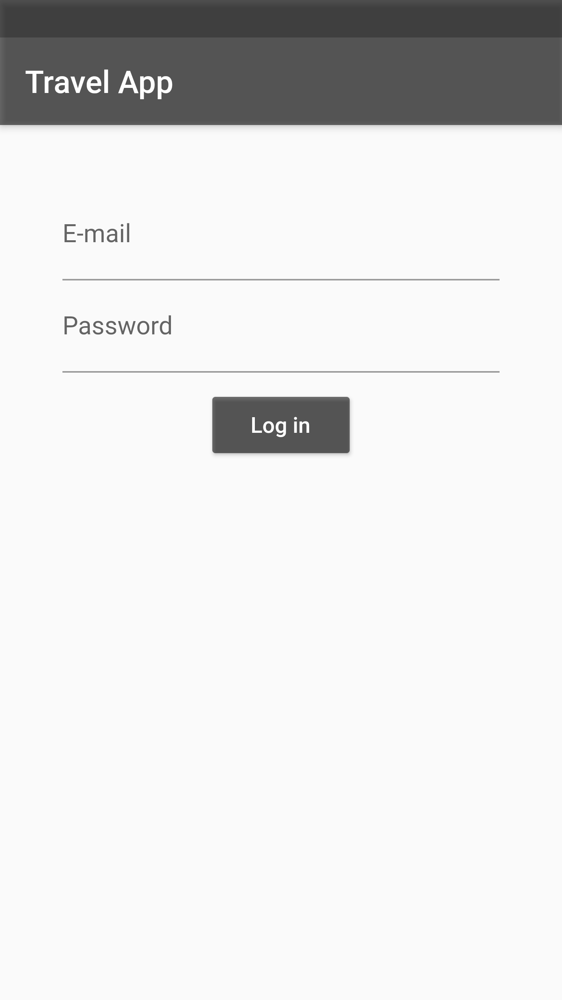
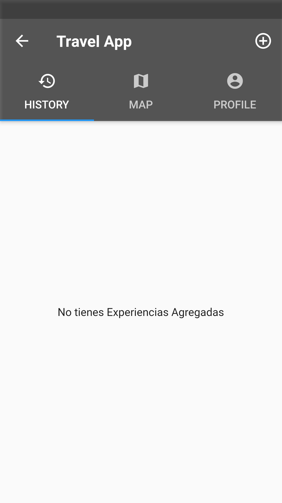
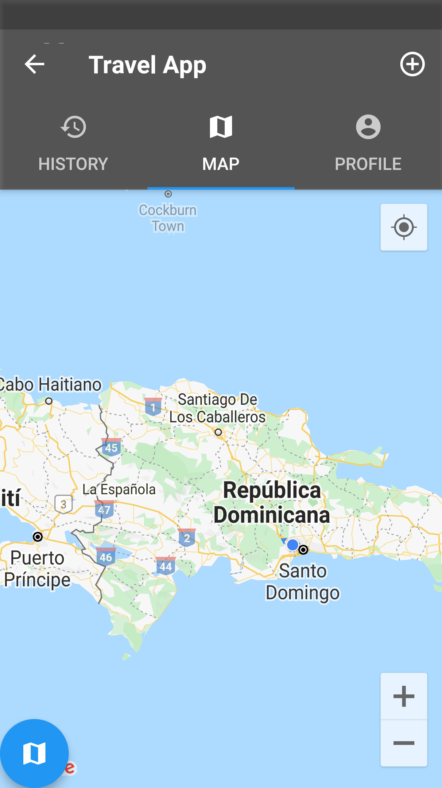
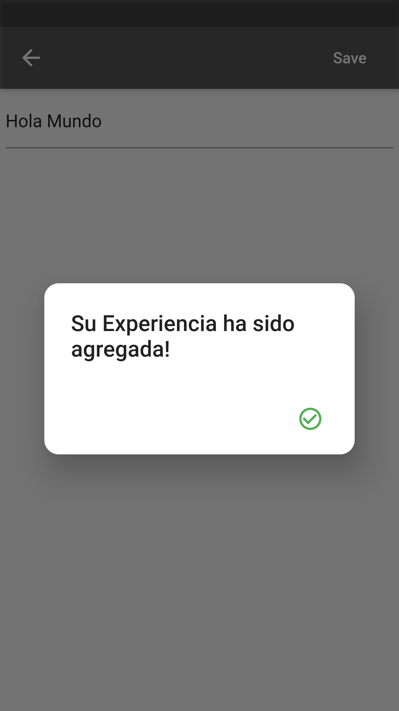

# FLUTTER APP

Aplicación básica creada con Flutter, en donde le permite al usuario poder interactuar con la aplicación a través de 3 apartados: Un Login, navegar en varias vista, y por último poder incertar alguna que otra información o experiencia como se le ha denominado en principio. 

La aplicación cuenta con un mapa en donde le permitirá al usuario poder saber su ubicación actual, y poder encontrar otra referencia a alguna dirección diferente a la actual.

## Herramientas y Tecnologías Utilizadas

- Android Studio
- Flutter
- Dart

